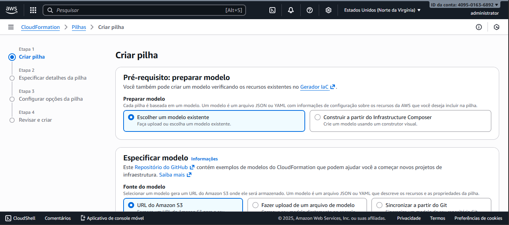
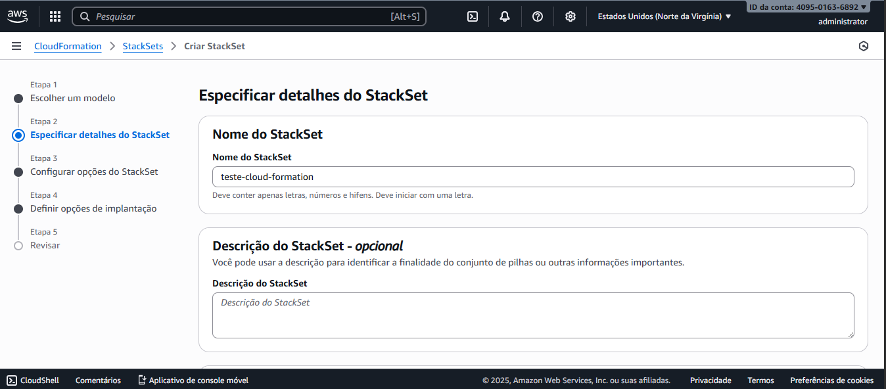

#  Implementando Infraestrutura Automatizada com AWS CloudFormation

Este desafio faz parte do **Bootcamp AWS Foundations** da DIO e tem como propósito entender na prática como o **AWS CloudFormation** permite **automatizar a criação e gerenciamento da infraestrutura** de forma simples, confiável e escalável.

---

## O que é o CloudFormation  

O **AWS CloudFormation** é um serviço que permite definir toda a infraestrutura da AWS usando **Infraestrutura como Código (IaC)**.  
Com ele, é possível criar, atualizar e gerenciar recursos como EC2, S3, IAM, entre outros, por meio de **templates em JSON ou YAML**.

 Em vez de configurar manualmente cada serviço, o CloudFormation usa um *modelo declarativo* que descreve como seu ambiente deve ser construído.

## Benefícios do CloudFormation  

✅ **Automação:** elimina configurações manuais e repetições.  
✅ **Padronização:** permite replicar ambientes idênticos em minutos.  
✅ **Segurança:** aplica políticas e regras consistentes em todos os recursos.  
✅ **Escalabilidade:** facilita implantações em múltiplas regiões e contas AWS.  
✅ **Economia:** reduz tempo de setup e reaproveita templates existentes.  

---

##  Experiência Prática  

Durante o desafio, explorei o processo de criação de **pilhas (Stacks)** e **StackSets**, entendendo como o CloudFormation organiza recursos de forma hierárquica e automatizada.

###  Etapa 1 – Criar Pilha  
- Escolhi a opção **“Escolher um modelo existente”**, onde é possível importar ou criar um template em JSON/YAML.  
- Visualizei como cada recurso é gerado automaticamente a partir do modelo.  

 **Captura:**  
 

---

###  Etapa 2 – Criar StackSet  
- Configurei um **StackSet** chamado `teste-cloud-formation` para entender como é possível implantar várias pilhas em diferentes contas ou regiões AWS, de forma simultânea.  

 **Captura:**  
 

##  Formatos aceitos  

O CloudFormation aceita dois formatos principais de template:  

| Formato | Descrição |
|----------|------------|
| **JSON** | Baseado em estrutura de chave-valor, ideal para automações e APIs |
| **YAML** | Mais legível e recomendado para documentação de IaC |

---

##  Diferença entre CloudFormation e Terraform  

| Ferramenta | Tipo | Suporte Multicloud | Gerenciado por |
|-------------|------|--------------------|----------------|
| **CloudFormation** | IaC nativo da AWS |  Não | AWS |
| **Terraform** | IaC de terceiros |  Sim (AWS, Azure, GCP...) | HashiCorp |

>  O CloudFormation é específico da AWS e totalmente integrado com seus serviços, enquanto o Terraform é multiplataforma e open source.

---

##  Lições Aprendidas  

- Infraestrutura como Código (IaC) é uma forma eficiente de gerenciar ambientes complexos.  
- CloudFormation fornece uma **abordagem declarativa**, permitindo que o código defina o estado desejado da infraestrutura.  
- A criação de pilhas e StackSets mostra o potencial da automação em escala na nuvem.  

>  **Conclusão:** CloudFormation simplifica a gestão de infraestrutura, reduz erros humanos e acelera o deploy de soluções AWS.

> “Com o CloudFormation, consegui visualizar como automatizar completamente a infraestrutura e criar ambientes consistentes e seguros em poucos cliques.”
